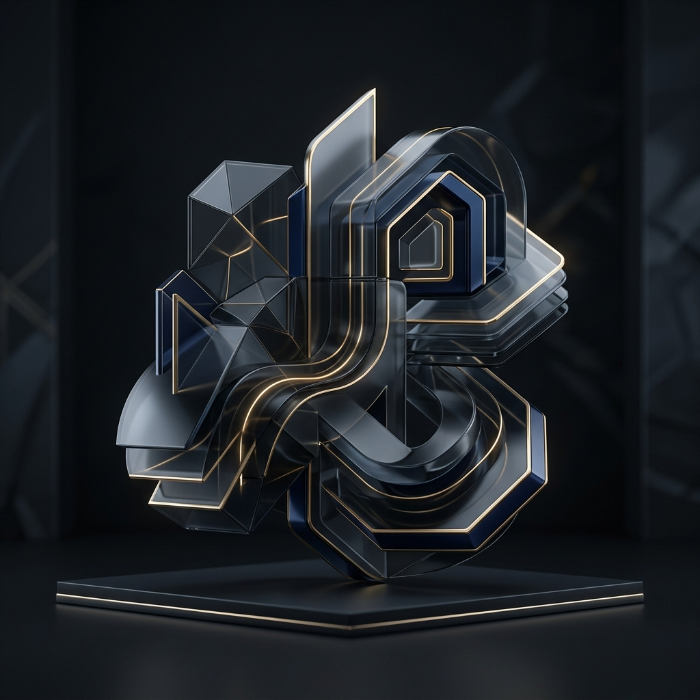

 

  

---

<table align="center">
<tr><td valign="top" width="50%">

### Front-End Mastery

  

</td><td valign="top" width="50%">

### Back-End & Infrastructure

  

</td></tr>
</table>

---

### Engineering Metrics

 

  

  

---

### Professional Synopsis

 

> *Senior Front-End Engineer specialized in building complex, interactive interfaces*
> *where performance is as critical as the visual narrative. I lead Syntra Agency,*
> *delivering enterprise-grade digital products with a focus on scalable architecture,*
> *design systems, and immersive user experiences powered by modern animation frameworks.*

 

<a href="https://xsyntra.netlify.app/">Portfolio</a>&nbsp;&nbsp;&nbsp;|&nbsp;&nbsp;&nbsp;<a href="https://linkedin.com/in/">LinkedIn</a>&nbsp;&nbsp;&nbsp;|&nbsp;&nbsp;&nbsp;<a href="mailto:contact@syntra.dev">Contact</a>

